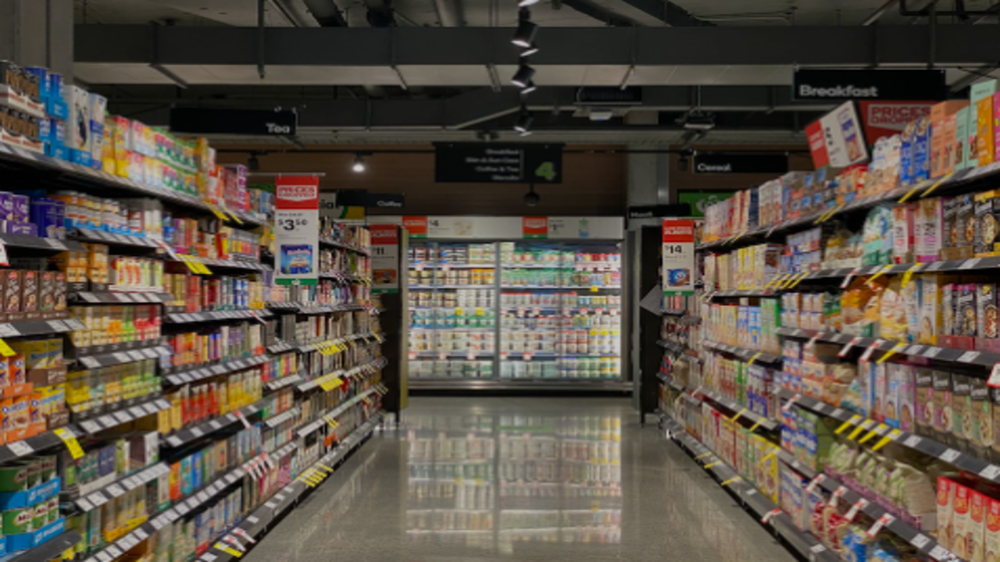
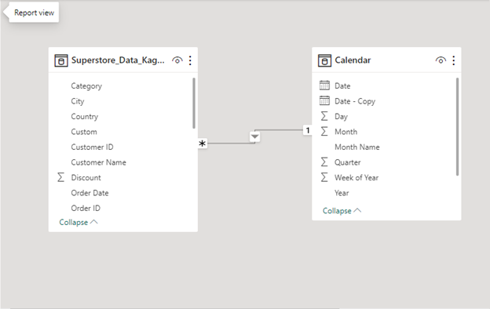
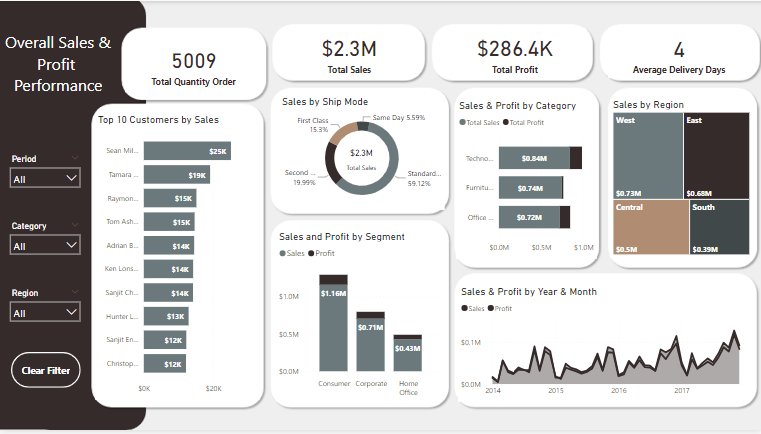
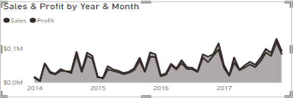
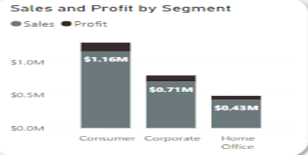
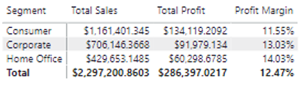

# SuperStore-Sales-Profit-Insight

### Introduction
---
This dataset provides a comprehensive collection of information regarding customer orders, products, sales, and profits, enabling me to delve into the dynamics of a retail environment. By exploring this dataset, I can gain a deeper understanding of the factors influencing store sales and profitability, identify key patterns and trends, and extract actionable insights to enhance business performance.

Power BI Concepts Applied:
•	DAX Concepts: Calculated Column, Customs Column, Calendar Table, Measures & Calculations.

•	Data Modelling: Star Schema (* : 1 relationships).

### Problem Statement
---
With growing demands and cut-throat competition in the market, Superstore 
Giant is seeking to understand what works best for them. They would like to understand which products, regions, categories, and customer segments they should target or avoid. The following questions are answered:

•	How long on average does an order take before delivery?

•	What is the total sales made yearly, since 2014? Have sales been on the increase over the years?

•	Which of our customers is most important?

•	Which of our products makes the greatest profit and which products run the store into loss?

•	Any other relevant data-driven insight into our sales.

### Data Sourcing
---
The data was downloaded from **_Kagle.com_** in CSV format and extracted into Powe BI for cleaning, analysis, and visualization.

I loaded the dataset and examined its structure, checked for missing values, and explored unique values in categorical columns to gain a preliminary understanding of the dataset. 

The dataset contains only 1 sheet/table:

Structure: The dataset has a total number of 9,994 rows and 21 columns.

Data Types: The data types of the columns are in different categories such as text, numbers, amount, and dates.

The columns "Row ID," "Postal Code," "Quantity," and "Profit" are represented as integers or numbers.

The columns "Sales," "Discount," and "Profit" are represented as decimal numbers.

The columns "Order Date" and "Ship Date" are currently stored as text types.

To facilitate time-series analysis, I converted columns "Order Date" and "Ship Date" to date-time stamp data type.
I also extract additional calendar date-related features like year, month, and day of the week from the 'Order Date' column for further analysis and visualization.

### Data Transformation/Cleaning
---
The data was efficiently cleaned and transformed with the Power Query Editor within Power BI [ a screenshot of the applied step] some of the applied steps included.

•	Make the first row a header.

•	Analytical transformation of the table: To have an idea of how long it takes on average for orders to be delivered, [delivery days] needs to be calculated using the “customs column” in Power Query– delivery days = [ship date] – [order date]. Then the average days using DAX on Power BI.
_Average Delivery Days = AVERAGE(Superstore_Data_Kaggle[Average Delivery Days])_ While the datatype was converted to a whole number.

•	I also extract additional calendar date-related features like year, month, and day of the week from the 'Order Date' column for further analysis and visualization.

### Data Modelling
---
Power BI automatically connected related tables resulting in a “Star Schema model”. ‘The Superstore_Data_Kagle Table’ is the ‘Fact table’ of the model. The ‘Calendar’ Table is the dimension table, and the ‘Calendar’ Table’ is connected to the ‘Superstore_Data_Kagle table’ via the common columns [order date].

  

  ### Data Analysis and Visualization
---

From the above dashboard:

1.	It is observed that it takes 4 days on average to deliver each product on every order.
   
2.	Total Order Quantity stood at 5,009 units for the 4-year period.
   
3.	Total Sales made in 2014 = $484k, 2015 = $471k, 2016 = $609k, and 2017 = $733k

### Trend Analysis
Trend analysis is carried out on the sales and profit to understand their pattern. Sales & Profit Overtime: I aggregated the Sales Value and Profit using this DAX formula to observe the trend over time.

_Total Sales = CALCULATE(SUM(Superstore_Data_Kaggle[Sales]))_

_Total Profit = CALCULATE(SUM(Superstore_Data_Kaggle[Profit]))_

**Analysis:** The line chart (stacked area chart) shows a clear upward trend in sales from January to December each year. It shows higher demand during certain months, possibly due to holiday seasons, festive occasions, or annual sales events. Further investigation is required to understand the reasons behind the sudden drop in sales in October. Possible factors could include changes in marketing strategies, external events, or product-related issues during that specific month. The yearly sales trend as shown below demonstrates an overall growth in sales from 2014 to 2017. In general, there is a similarity in the trend of the profit graph with the sales graph. When sales increase, it leads to a corresponding increase in profit, and vice versa.

### Segment-wise Sales & Profit
In this section, I compare the sales and profit across different segments. I have 3 segments in this dataset Consumer, Corporate, and Home Office.

At first sight, the "Consumer" segment has the highest sales ($1,16m) and the highest profit ($134k). But can I claim that it is the most profitable segment? The answer is No. I should look at the Profit Margin. It looks like the "Home Office" has the highest profit margin of (14%). Let's check it from the table below.

From the table above, we can see that the "Home Office" segment has the highest Profit/Sales ratio of 14%, making it the most efficient in terms of profitability. The "Consumer" segment has the lowest Profit/Sales ratio of 12%, suggesting that it retains a slightly lower proportion of its sales revenue as profit compared to the other segments.
Overall, the Profit Margin for all three segments is relatively close, indicating that the company is generally managing profitability efficiently across its different customer segments.

